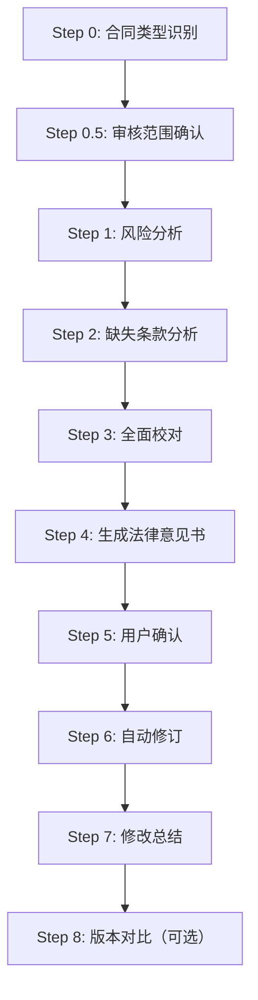

# Contract Review Skill / 合同审核技能

<div align="center">


**专业的 AI 合同审核助手 | Professional AI Contract Review Assistant**

[English](#english) | [中文](#中文)

</div>

---

## 中文

### 简介

这是一个专为 Claude Code 设计的合同审核技能（Skill），能够代表客户利益对各类合同进行专业审核。通过 9 步标准化工作流程，自动识别风险、分析缺失条款、生成法律意见书，并可自动生成带修订标记的合同文档。

### ✨ v2.0.0 新功能

> 🎉 **重大更新！** 从 7 步工作流扩展到 9 步，新增多项专业功能。

#### 🆕 新增功能

| 功能 | 描述 |
|------|------|
| **合同类型自动识别** | 支持 10 种合同类型，自动加载对应的专项检查清单 |
| **审核范围确认** | 确认客户身份、重点关注领域、行业合规要求 |
| **法律依据引用** | 每个风险点都引用具体法条（民法典、劳动法等） |
| **版本对比功能** | 对比两个合同版本，生成差异报告并标注风险等级 |
| **Mermaid 业务流程图** | 法律意见书中自动生成合同业务流程图 |
| **法律法规速查手册** | 覆盖 9 大法律领域，快速定位法律依据 |

#### 📚 新增专项检查清单

- 股权/股东协议 (`equity_shareholder.md`)
- 投资协议 (`investment.md`)
- 劳动合同 (`employment.md`)
- 租赁协议 (`lease.md`)
- 服务/咨询协议 (`service.md`)
- 买卖/采购合同 (`sales_purchase.md`)
- 保密协议 (`nda.md`)

#### 🔧 增强功能

- **多语言支持**: 输出语言自动匹配合同原文语言
- **增强的错误处理**: 完整的错误提示和回退方案
- **法律意见书模板**: 标准化的专业意见书格式
- **脚本增强**: 更好的 Track Changes 支持和日志记录

### 📁 目录结构

```
contract-review/
├── SKILL.md                          # 主技能文件
├── README.md                         # 说明文档
├── CHANGELOG.md                      # 更新日志
├── references/
│   ├── common_clauses.md             # 常用条款参考（中英双语）
│   ├── legal_references.md           # 法律法规速查手册
│   ├── review_checklist.md           # 通用审核清单
│   └── contract_types/               # 分类型专项检查清单
│       ├── equity_shareholder.md
│       ├── investment.md
│       ├── employment.md
│       ├── lease.md
│       ├── service.md
│       ├── nda.md
│       └── sales_purchase.md
├── scripts/
│   ├── revise_contract.py            # 合同修订脚本
│   ├── read_full_docx.py             # DOCX 读取脚本
│   ├── extract_contract_info.py      # 合同信息提取
│   └── compare_versions.py           # 版本对比工具
└── templates/
    └── legal_opinion_template.md     # 法律意见书模板
```

### 🚀 使用方法

#### 基本用法

```
用户: 帮我审核这份《股权转让协议》
```

Claude 将自动执行完整的 9 步审核流程。

#### 触发词

- 审核协议 / 审核合同 / 合同审核
- Review Agreement / Audit Contract
- 看一下这个合同 / 帮我审合同

#### 快捷命令

| 命令 | 功能 |
|------|------|
| `/review [file]` | 启动完整合同审核 |
| `/extract [file]` | 仅提取合同元数据 |
| `/compare [v1] [v2]` | 对比两个合同版本 |

### 📋 9 步工作流程



### ⚙️ 安装

1. 克隆仓库到 Claude Code skills 目录：

```bash
git clone https://github.com/lennonli/contract-review.git ~/.claude/skills/contract-review
```

2. 安装 Python 依赖（用于自动修订功能）：

```bash
pip install python-docx PyPDF2
```

### 📄 支持的文件格式

- `.docx` - Microsoft Word 文档
- `.pdf` - PDF 文档
- `.txt` - 纯文本文件

### ⚖️ 法律声明

本技能生成的内容仅供参考，不构成正式法律意见。具体法律问题请咨询执业律师。

---

## English

### Introduction

This is a professional contract review skill designed for Claude Code. It represents the client's interests to review various types of contracts through a standardized 9-step workflow, automatically identifying risks, analyzing missing clauses, generating legal opinions, and creating revised documents with track changes.

### ✨ What's New in v2.0.0

> 🎉 **Major Update!** Expanded from 7-step to 9-step workflow with many new professional features.

#### 🆕 New Features

| Feature | Description |
|---------|-------------|
| **Auto Contract Type Detection** | Supports 10 contract types with specialized checklists |
| **Scope Confirmation** | Confirm client identity, focus areas, compliance requirements |
| **Legal Basis Citations** | Each risk cites specific legal provisions |
| **Version Comparison** | Compare two contract versions with risk-rated diff report |
| **Mermaid Flowcharts** | Auto-generated business flow diagrams in legal opinions |
| **Legal Reference Guide** | Covers 9 legal areas for quick reference |

#### 📚 New Specialized Checklists

- Equity/Shareholder Agreement
- Investment Agreement
- Employment Contract
- Lease Agreement
- Service/Consulting Agreement
- Sales/Purchase Contract
- NDA/Confidentiality Agreement

### 🚀 Usage

```
User: Please review this Service Agreement
```

Claude will automatically execute the complete 9-step review process.

### 📋 9-Step Workflow

1. **Contract Type Identification** - Auto-detect and load specialized checklist
2. **Scope Confirmation** - Confirm client party and focus areas
3. **Risk Analysis** - Identify and categorize risks with legal citations
4. **Gap Analysis** - Find missing protective clauses
5. **Proofreading** - Check for typos, logic, formatting issues
6. **Legal Opinion** - Generate formal opinion with Mermaid flowchart
7. **User Confirmation** - Pause for approval before revisions
8. **Auto Revision** - Generate document with track changes
9. **Summary** - Provide key modification summary
10. **Version Compare** - (Optional) Compare contract versions

### ⚖️ Disclaimer

This skill is for reference only and does not constitute formal legal advice. Please consult a licensed attorney for specific legal issues.

---

## 📜 License

MIT License

## 🤝 Contributing

Issues and Pull Requests are welcome!

## 📧 Contact

- GitHub: [@lennonli](https://github.com/lennonli)
