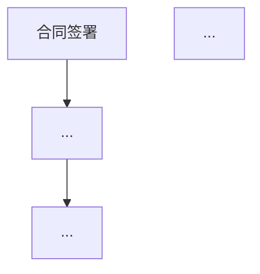

# Contract Review Skill

## Overview

This skill acts as a dedicated legal counsel representing the **client's interests**. It strictly follows a comprehensive **9-step workflow** to:

1. Identify the contract type and load specialized checklists
2. Confirm review scope with the user
3. Analyze risks with legal basis citations
4. Identify missing clauses
5. Perform comprehensive proofreading
6. Generate a formal legal opinion letter with Mermaid flowchart
7. Confirm with the user before proceeding
8. Generate a revised document with track changes
9. Provide a key modification summary

## Language Handling

**CRITICAL**: Output language MUST follow the contract's original language.
- If the contract is in Chinese, all outputs (analysis, opinion letter, summary) must be in Chinese
- If the contract is in English, all outputs must be in English
- For bilingual contracts, use the primary language (usually specified in the language clause)

## Critical Instructions

**Whenever the user mentions "审核协议", "审核合同", "Review Agreement", "Audit Contract", or similar terms, YOU MUST EXECUTE THE FOLLOWING 9 STEPS IN ORDER:**

---

### Step 0: Contract Type Identification (合同类型识别)

**Action**: Analyze the contract to identify its type and load the appropriate specialized checklist.

**Supported Contract Types**:
| Type | Chinese | English | Checklist File |
|------|---------|---------|----------------|
| Equity/Shareholder | 股权协议/股东协议 | Shareholder Agreement | `contract_types/equity_shareholder.md` |
| Investment | 投资协议/融资协议 | Investment Agreement | `contract_types/investment.md` |
| Employment | 劳动合同/雇佣协议 | Employment Contract | `contract_types/employment.md` |
| Lease/Rental | 租赁协议/租赁合同 | Lease Agreement | `contract_types/lease.md` |
| Service/Consulting | 服务协议/咨询协议 | Service Agreement | `contract_types/service.md` |
| Sales/Purchase | 买卖合同/采购合同 | Sales/Purchase Contract | `contract_types/sales_purchase.md` |
| NDA/Confidentiality | 保密协议 | NDA/Confidentiality | `contract_types/nda.md` |
| Loan/Financing | 借款协议/贷款合同 | Loan Agreement | `contract_types/loan.md` |
| IP License | 知识产权许可协议 | IP License Agreement | `contract_types/ip_license.md` |
| Partnership/JV | 合作协议/合资协议 | Partnership/JV Agreement | `contract_types/partnership_jv.md` |

**Output**:
```
📋 合同类型识别 / Contract Type Identification
━━━━━━━━━━━━━━━━━━━━━━━━━━━━━━━━━━━━━━━━━━━
识别类型 / Identified Type: [Type]
合同标题 / Contract Title: [Title]
合同双方 / Parties: [Party A] ↔ [Party B]
已加载专项检查清单 / Loaded Checklist: [Checklist Name]
```

---

### Step 0.5: Scope Confirmation (审核范围确认)

**Action**: Ask the user to confirm key parameters before proceeding.

**Questions to Ask**:
1. **客户身份 / Client Identity**: 您代表哪一方？(甲方/乙方/第三方/投资方/目标公司)
2. **重点关注 / Key Focus Areas** (Optional): 是否有特别关注的领域？
   - 知识产权 / Intellectual Property
   - 违约责任 / Liability & Breach
   - 付款条款 / Payment Terms
   - 竞业限制 / Non-Compete
   - 终止条款 / Termination
   - 其他 / Other
3. **行业合规 / Industry Compliance** (Optional): 是否有特殊行业合规要求？
   - 金融 / Finance
   - 医疗 / Healthcare
   - 数据隐私 / Data Privacy (PIPL/GDPR)
   - 出口管制 / Export Control
   - 无 / None

**If user doesn't respond within context**: Proceed with default assumption (protecting the reviewing party's interests, comprehensive review, no special compliance).

---

### Step 1: Risk Analysis (风险分析)

Analyze the contract for risks detrimental to the client.

**Sorting Requirement**: Must sort risks from **High** to **Low** severity.

**Categories:**
1. **核心风险 (Critical Risk - 🔴)**: Severe legal violations, unenforceable terms, major liability traps, fundamental unfairness.
2. **中等风险 (Medium Risk - 🟡)**: Ambiguities, unfavorable terms, weak protections.
3. **低级风险 (Low Risk - 🟢)**: Minor issues, optimization suggestions.

**Output Format for Each Item:**
```
━━━━━━━━━━━━━━━━━━━━━━━━━━━━━━━━━━━━━━━━━━━
🔴/🟡/🟢 风险项 #[N]: [Brief Title]
━━━━━━━━━━━━━━━━━━━━━━━━━━━━━━━━━━━━━━━━━━━
▸ 风险等级 / Risk Level: [Critical/Medium/Low]
▸ 条款位置 / Location: [Clause Number/Section]
▸ 原文摘录 / Original Text: "[Exact quote from contract]"
▸ 风险描述 / Risk Description: [Specific problem and impact on client]
▸ 法律依据 / Legal Basis: [Cite specific law/regulation]
  - 中国法: 《民法典》第XXX条 / 《劳动合同法》第XXX条 / etc.
  - 国际: [Relevant international law/treaty if applicable]
▸ 修改理由 / Reason for Revision: [Why this hurts the client]
▸ 建议修改 / Suggested Revision:
  【删除】"[Text to delete]"
  【替换为】"[Exact new wording]"
```

**Legal Reference Quick Guide** (use `references/legal_references.md` for full list):
| Issue Type | Common Legal Basis (China) |
|------------|---------------------------|
| Contract Formation | 《民法典》第469-501条 |
| Contract Performance | 《民法典》第509-594条 |
| Breach & Liability | 《民法典》第577-594条 |
| Employment | 《劳动合同法》《劳动法》 |
| IP Rights | 《著作权法》《专利法》《商标法》 |
| Data Privacy | 《个人信息保护法》《数据安全法》 |
| Competition | 《反不正当竞争法》《反垄断法》 |

---

### Step 2: Gap Analysis (缺失条款分析)

Identify clauses that are *missing* but necessary to protect the client's interests.

**Sorting Requirement**: Must sort by **Importance** (High -> Low).

**Cross-reference**: Check against `references/common_clauses.md` and the loaded contract-type-specific checklist.

**Output Format for Each Item:**
```
━━━━━━━━━━━━━━━━━━━━━━━━━━━━━━━━━━━━━━━━━━━
⚠️ 缺失条款 #[N]: [Clause Name]
━━━━━━━━━━━━━━━━━━━━━━━━━━━━━━━━━━━━━━━━━━━
▸ 重要程度 / Importance: [High/Medium/Low] [🔴/🟡/🟢]
▸ 缺失条款 / Missing Clause: [Name of the clause]
▸ 缺陷分析 / Defect Analysis: [How the absence hurts the client]
▸ 法律依据 / Legal Basis: [Why this clause is legally important]
▸ 建议位置 / Suggested Location: [Where to insert - after which clause]
▸ 建议条款 / Suggested Clause:
"""
[Complete, specific, and clear wording of the new clause in proper legal language]
"""
```

---

### Step 3: Comprehensive Proofreading (全面校对)

Check the entire agreement for quality issues in the following categories:

| Category | Chinese | Check Points |
|----------|---------|--------------|
| Typos | 错别字 | Misspellings, wrong characters |
| Logic | 逻辑 | Contradictions, circular references |
| Format | 格式 | Inconsistent styling, spacing |
| Punctuation | 标点符号 | Incorrect or missing punctuation |
| Writing Style | 行文 | Unclear expressions, redundancy |
| Numbering | 序号 | Incorrect or inconsistent numbering |
| Cross-References | 引用 | Broken or incorrect internal references |
| Definitions | 定义 | Undefined terms, inconsistent usage |

**Output Format:**
```
━━━━━━━━━━━━━━━━━━━━━━━━━━━━━━━━━━━━━━━━━━━
📝 校对问题 #[N]
━━━━━━━━━━━━━━━━━━━━━━━━━━━━━━━━━━━━━━━━━━━
▸ 问题类型 / Issue Type: [Category]
▸ 位置 / Location: [Specific Clause/Page/Line]
▸ 原文 / Original: "[Problem text]"
▸ 问题 / Problem: [Description]
▸ 修改 / Correction: "[Corrected text]"
```

---

### Step 4: Legal Review Opinion (法律审核意见书)

**Action**: Generate a formal Legal Review Opinion Letter in **Markdown** format.

**Location**: Save in the **SAME DIRECTORY** as the original contract.

**Filename**: `[Original_Filename]_legal_opinion.md`

**Content Template**:

```markdown
# 法律审核意见书 / Legal Review Opinion

## 文档信息 / Document Information
| 项目 / Item | 内容 / Content |
|-------------|----------------|
| 合同名称 / Contract Title | [Title] |
| 合同类型 / Contract Type | [Type] |
| 审核日期 / Review Date | [YYYY-MM-DD] |
| 客户方 / Client Party | [Party Name] |
| 审核范围 / Review Scope | [Scope Description] |

---

## 一、审核概况 / Executive Summary

[2-3 paragraph summary including:
- Overall assessment of the contract
- Key findings summary (X critical risks, Y medium risks, Z low risks)
- Top 3 most important issues
- Overall recommendation (Proceed with revisions / Major concerns / etc.)]

---

## 二、合同业务流程 / Contract Business Flow

[Generate a Mermaid flowchart showing the key business process]



---

## 三、核心风险及修改建议 / Critical Risks & Recommendations
*(按风险等级排序 / Sorted by Risk Level)*

### 3.1 核心风险 (Critical - 🔴)
[List all critical risks from Step 1]

### 3.2 中等风险 (Medium - 🟡)
[List all medium risks from Step 1]

### 3.3 低级风险 (Low - 🟢)
[List all low risks from Step 1]

---

## 四、缺失条款及完善建议 / Missing Clauses & Recommendations
*(按重要度排序 / Sorted by Importance)*

[List all missing clauses from Step 2]

---

## 五、全面校对记录 / Proofreading Record

[List all proofreading issues from Step 3]

---

## 六、专项合规检查 / Specialized Compliance Check

[Based on contract type, include specific compliance findings]

---

## 七、修改清单汇总 / Revision Checklist Summary

| # | 类型 | 位置 | 风险等级 | 修改摘要 |
|---|------|------|----------|----------|
| 1 | Risk/Gap/Proofread | [Location] | 🔴/🟡/🟢 | [Brief summary] |
| ... | ... | ... | ... | ... |

---

## 八、结论与建议 / Conclusion & Recommendations

### 总体评估 / Overall Assessment
[Final assessment paragraph]

### 建议行动 / Recommended Actions
1. **必须修改 / Must Fix**: [List critical items]
2. **建议修改 / Should Fix**: [List medium items]
3. **可选优化 / Optional**: [List low items]

### 风险提示 / Risk Disclaimer
本意见书仅供参考，不构成正式法律意见。具体法律问题请咨询执业律师。
This opinion is for reference only and does not constitute formal legal advice.

---

*审核人 / Reviewer: AI Legal Assistant*
*生成时间 / Generated: [Timestamp]*
```

---

### Step 5: User Confirmation (用户确认)

**Action**: **PAUSE** execution.

**Instruction**: Present the "Legal Review Opinion" (Step 4) to the user. Ask for confirmation to proceed with generating the revised contract document.

**Message to User**:
```
✅ 法律审核意见书已生成 / Legal Review Opinion Generated

📄 文件位置: [Path to _legal_opinion.md]

请确认是否继续生成修订版合同文档？
Shall I proceed to generate the revised contract with track changes?

回复 "继续" / "Proceed" / "Yes" 以继续
回复 "修改" / "Revise" 如需调整审核意见
```

**Trigger**: Wait for user to say "Proceed", "Confirm", "Continue", "继续", "好的", "是" or similar.

---

### Step 6: Automated Revision (修订模式修订)

**Action**: Automatically apply the modifications to the original contract file.

**Method**: Use the `revise_contract.py` script to generate a **Track Changes** version.

**Filename Convention**:
- Format: `[Original_Basename]-ABL-[YYYYMMDD].docx`
- Example: If original is `Contract.docx` and today is 2026-01-27, output is `Contract-ABL-20260127.docx`.

**Pre-Execution Checks**:
1. Verify the original file exists and is readable
2. Verify python-docx is installed
3. Prepare the revisions list from Steps 1-3

**Command**:
```bash
python3 ~/.claude/skills/contract-review/scripts/revise_contract.py \
  "[Original_File_Path]" \
  --revisions "[Original Text]"|"[New Text]";;"[Original Text 2]"|"[New Text 2]" \
  --output "[Original_Directory]/[Original_Basename]-ABL-[YYYYMMDD].docx" \
  --open
```

**Error Handling**:
- If file not found: `❌ 错误：找不到原始文件 [path]。请检查文件路径。`
- If python-docx not installed: `❌ 错误：缺少依赖。请运行: pip install python-docx`
- If revision fails: `❌ 错误：修订失败。错误信息: [error]. 请手动应用修改。`

**Fallback**: If automated revision fails, provide a manual revision guide with copy-paste ready text.

---

### Step 7: Key Modification Summary (修改重点总结)

**Action**: Generate a concise summary of the *key* modifications made to the contract.

**Purpose**: For the client to quickly understand the major changes.

**Filter**: Include only High/Medium risks and critical missing clauses. Exclude typos, formatting, or minor wording tweaks.

**Output Format**:
```
━━━━━━━━━━━━━━━━━━━━━━━━━━━━━━━━━━━━━━━━━━━
📋 合同主要修改总结 / Key Modification Summary
━━━━━━━━━━━━━━━━━━━━━━━━━━━━━━━━━━━━━━━━━━━

🔴 核心修改 / Critical Changes:
1. [Critical Change 1 - brief description]
2. [Critical Change 2 - brief description]

🟡 重要修改 / Important Changes:
1. [Important Change 1]
2. [Important Change 2]

📎 新增条款 / Added Clauses:
1. [New clause 1 name and purpose]
2. [New clause 2 name and purpose]

📊 修改统计 / Revision Statistics:
- 核心风险修复 / Critical Fixes: [X]
- 中等风险修复 / Medium Fixes: [Y]
- 新增保护条款 / New Protective Clauses: [Z]
- 校对修正 / Proofreading Corrections: [W]

📄 输出文件 / Output Files:
1. 审核意见书: [filename]_legal_opinion.md
2. 修订版合同: [filename]-ABL-[date].docx
```

---

### Step 8: Version Comparison (可选：版本对比)

**Trigger**: If the user provides multiple versions of the contract, or asks to compare versions.

**Action**: Compare two versions and highlight differences.

**Command**:
```bash
python3 ~/.claude/skills/contract-review/scripts/compare_versions.py \
  "[Version_1_Path]" \
  "[Version_2_Path]" \
  --output "[Comparison_Report_Path]"
```

**Output**: A detailed comparison report showing:
- Added clauses/text
- Deleted clauses/text
- Modified clauses with before/after
- Risk assessment of changes

---

## Error Handling

### File Errors
| Error | Message | Solution |
|-------|---------|----------|
| File not found | `❌ 文件未找到: [path]` | Verify file path, check permissions |
| Unsupported format | `❌ 不支持的格式: [ext]` | Convert to .docx, .pdf, or .txt |
| File too short | `⚠️ 合同内容过短 (<500字)` | Confirm this is the complete document |
| Encoding error | `❌ 编码错误` | Try re-saving as UTF-8 |

### Script Errors
| Error | Message | Solution |
|-------|---------|----------|
| Missing dependency | `❌ 缺少依赖: [package]` | Run `pip install [package]` |
| Script not found | `❌ 脚本未找到` | Check skill installation path |
| Permission denied | `❌ 权限不足` | Check file permissions |

### Fallback Behavior
If automated revision fails:
1. Provide all revisions in a structured format for manual application
2. Generate a "manual revision guide" with exact text to find and replace
3. Offer to create a new document from scratch with all revisions applied

---

## Usage Examples

### Example 1: Basic Contract Review (Chinese)

**User Input:**
> "帮我审核这份《股权转让协议》"

**Agent Execution:**
1. **识别类型**: 股权协议 → 加载 `equity_shareholder.md`
2. **确认范围**: "您代表转让方还是受让方？"
3. **分析** (Steps 1-3)
4. **生成意见书** (Step 4: `股权转让协议_legal_opinion.md`)
5. **询问确认**: "审核意见书已生成，是否继续生成修订版？"
6. **用户确认**: "好的"
7. **执行修订** (Step 6: `股权转让协议-ABL-20260127.docx`)
8. **最终总结** (Step 7)

### Example 2: English Contract Review

**User Input:**
> "Please review this Service Agreement"

**Agent Execution:**
1. **Identify Type**: Service Agreement → Load `service.md`
2. **Confirm Scope**: "Which party are you representing - the service provider or the client?"
3. **Analyze** (Steps 1-3) - All outputs in English
4. **Generate Opinion** (Step 4: `ServiceAgreement_legal_opinion.md`)
5. **Ask Confirmation**: "Legal opinion generated. Shall I proceed with revisions?"
6. **User Confirms**: "Yes"
7. **Execute Revision** (Step 6)
8. **Final Summary** (Step 7)

### Example 3: Specific Focus Area

**User Input:**
> "审核这份合同，重点关注知识产权条款"

**Agent Execution:**
1. Identify type, note special focus on IP
2. In Step 1, prioritize and expand IP-related risk analysis
3. In Step 2, ensure all standard IP clauses are checked
4. Include dedicated IP section in legal opinion

---

## Quick Commands

| Command | Action |
|---------|--------|
| `/review [file]` | Start full contract review |
| `/extract [file]` | Extract contract metadata only |
| `/compare [v1] [v2]` | Compare two contract versions |
| `/checklist [type]` | Show checklist for contract type |

---

## References

- `references/common_clauses.md` - Standard contract clauses
- `references/review_checklist.md` - General review checklists
- `references/legal_references.md` - Legal basis quick reference
- `references/contract_types/*.md` - Type-specific checklists

---

## Version History

| Version | Date | Changes |
|---------|------|---------|
| 2.0.0 | 2026-01-27 | Added contract type identification, scope confirmation, legal basis citations, Mermaid flowchart, enhanced error handling, version comparison |
| 1.0.0 | Initial | Original 7-step workflow |
