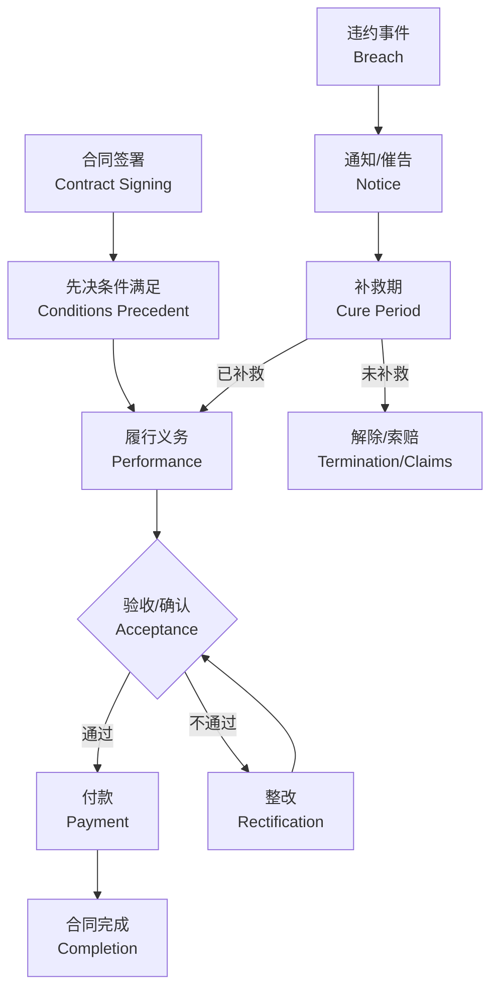

# 法律审核意见书模板
# Legal Review Opinion Template

---

# 法律审核意见书 / Legal Review Opinion

## 文档信息 / Document Information

| 项目 / Item | 内容 / Content |
|-------------|----------------|
| 合同名称 / Contract Title | [CONTRACT_TITLE] |
| 合同类型 / Contract Type | [CONTRACT_TYPE] |
| 审核日期 / Review Date | [REVIEW_DATE] |
| 客户方 / Client Party | [CLIENT_PARTY] |
| 对方 / Counterparty | [COUNTERPARTY] |
| 审核范围 / Review Scope | [REVIEW_SCOPE] |

---

## 一、审核概况 / Executive Summary

### 1.1 总体评估 / Overall Assessment

[2-3段总体评价，包括:]
- 合同整体风险水平（高/中/低）
- 主要问题数量统计
- 总体建议（建议签署/建议修改后签署/不建议签署）

### 1.2 关键发现 / Key Findings

| 发现类型 | 数量 | 风险等级 |
|----------|------|----------|
| 核心风险 | [X] | 🔴 Critical |
| 中等风险 | [Y] | 🟡 Medium |
| 低级风险 | [Z] | 🟢 Low |
| 缺失条款 | [W] | ⚠️ |
| 校对问题 | [V] | 📝 |

### 1.3 优先处理事项 / Priority Actions

1. **[最重要的问题]** - [简述]
2. **[次重要的问题]** - [简述]
3. **[第三重要的问题]** - [简述]

---

## 二、合同业务流程 / Contract Business Flow

---

## 三、核心风险及修改建议 / Critical Risks & Recommendations

### 3.1 核心风险 (Critical - 🔴)

#### 风险项 #1: [风险标题]

| 项目 | 内容 |
|------|------|
| **位置** | 第X条 / Article X |
| **原文** | "[原文摘录]" |
| **风险描述** | [具体风险和对客户的影响] |
| **法律依据** | [法条引用] |
| **修改建议** | [具体修改文字] |

---

### 3.2 中等风险 (Medium - 🟡)

[同上格式列出中等风险]

---

### 3.3 低级风险 (Low - 🟢)

[同上格式列出低级风险]

---

## 四、缺失条款及完善建议 / Missing Clauses & Recommendations

### 4.1 高优先级缺失条款

#### 缺失条款 #1: [条款名称]

| 项目 | 内容 |
|------|------|
| **重要程度** | 🔴 高 |
| **缺陷分析** | [缺失该条款对客户的影响] |
| **法律依据** | [为何需要该条款] |
| **建议位置** | 第X条之后 |
| **建议条款** | [完整条款文字] |

---

### 4.2 中优先级缺失条款

[同上格式]

---

## 五、全面校对记录 / Proofreading Record

| # | 类型 | 位置 | 问题 | 修正 |
|---|------|------|------|------|
| 1 | [错别字/逻辑/格式等] | [位置] | [问题描述] | [修正后文字] |
| 2 | ... | ... | ... | ... |

---

## 六、专项合规检查 / Specialized Compliance Check

### 6.1 适用法律合规性

- [ ] 符合《民法典》相关规定
- [ ] 符合行业特殊法规要求
- [ ] 无明显违法条款

### 6.2 特殊事项检查

[根据合同类型填写，如劳动合同检查《劳动合同法》合规性]

---

## 七、修改清单汇总 / Revision Checklist Summary

| # | 类型 | 位置 | 风险等级 | 修改摘要 | 状态 |
|---|------|------|----------|----------|------|
| 1 | Risk | 第X条 | 🔴 | [摘要] | ⬜ 待修改 |
| 2 | Gap | 新增 | 🟡 | [摘要] | ⬜ 待修改 |
| 3 | Proofread | 第Y条 | 🟢 | [摘要] | ⬜ 待修改 |

---

## 八、结论与建议 / Conclusion & Recommendations

### 8.1 总体结论 / Overall Conclusion

[根据审核结果给出总体结论]

**风险评级**: [高风险 / 中等风险 / 低风险]

**签署建议**:
- [ ] 建议签署
- [ ] 建议修改后签署
- [ ] 不建议签署

### 8.2 建议行动清单 / Recommended Actions

#### 必须修改 (Must Fix) 🔴
1. [项目1]
2. [项目2]

#### 建议修改 (Should Fix) 🟡
1. [项目1]
2. [项目2]

#### 可选优化 (Nice to Have) 🟢
1. [项目1]
2. [项目2]

### 8.3 下一步 / Next Steps

1. 与对方协商修改核心风险条款
2. 补充缺失的保护性条款
3. 确认修改后进行最终审核

---

## 免责声明 / Disclaimer

本意见书仅供参考，不构成正式法律意见。本意见书基于所提供文件进行分析，未进行独立的事实核查。具体法律问题请咨询执业律师。

This opinion is for reference only and does not constitute formal legal advice. This opinion is based on the documents provided and no independent fact verification has been conducted. Please consult a licensed attorney for specific legal issues.

---

*审核人 / Reviewer: AI Legal Assistant (Contract Review Skill v2.0)*

*生成时间 / Generated: [TIMESTAMP]*
